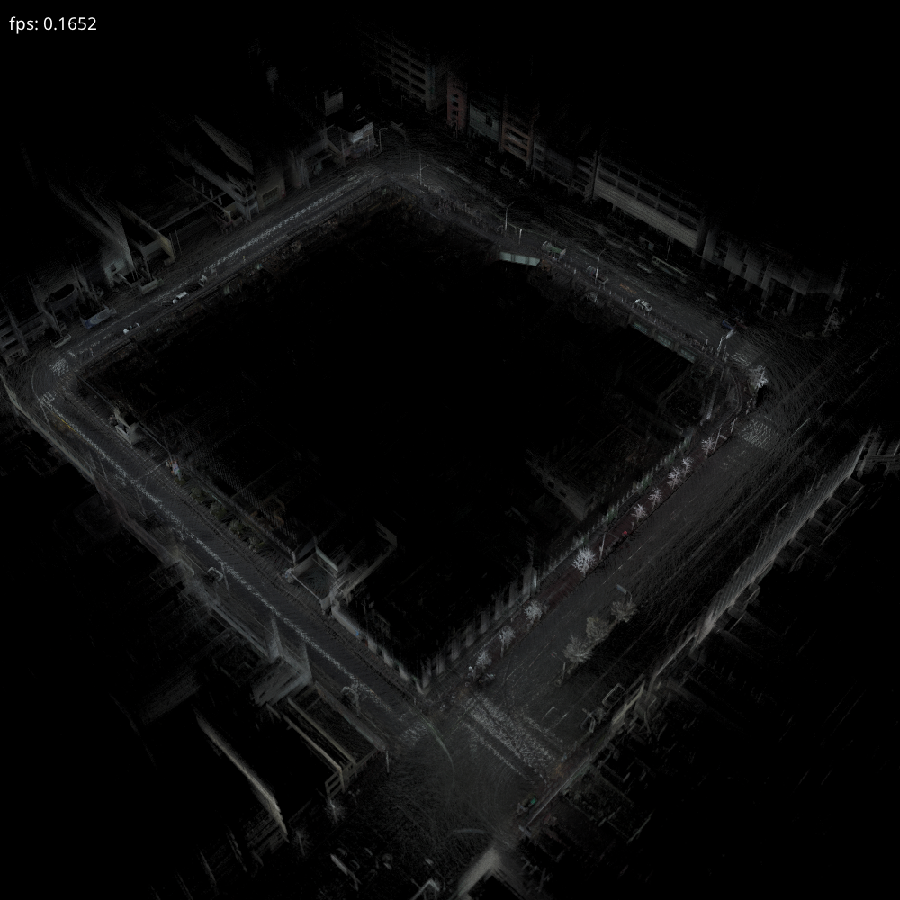
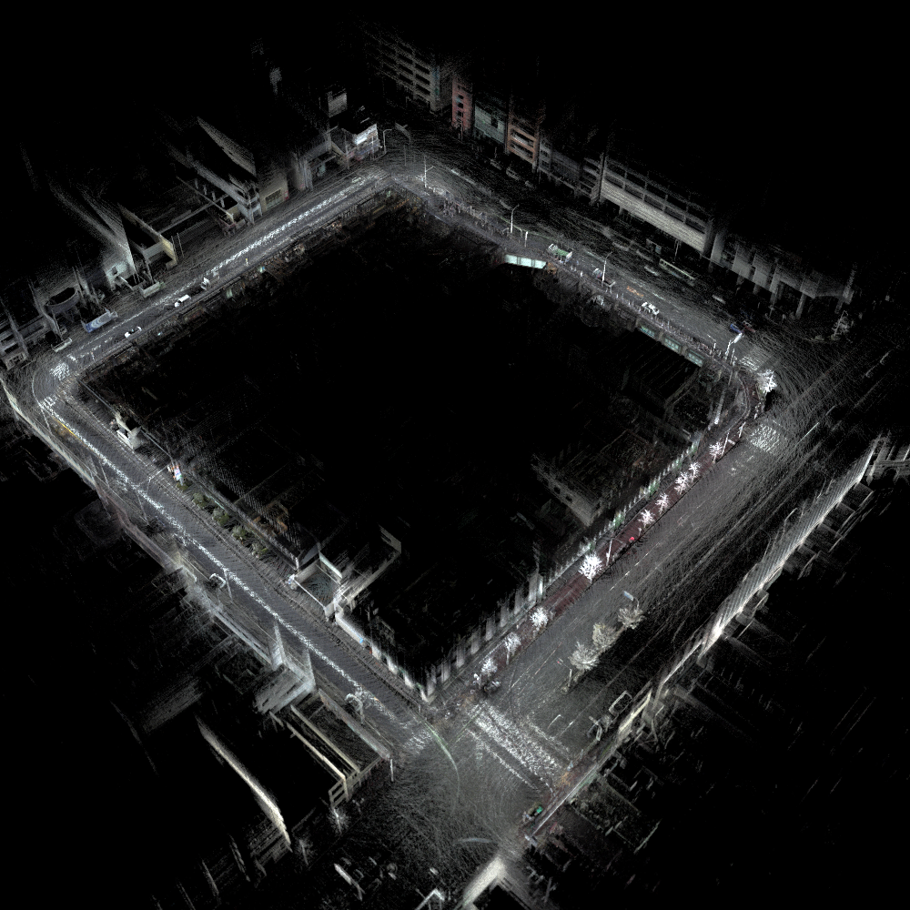

# SPBR_Brightness-Adjustment

## Demo

## Results
|Original Image|Adjusted Image|
|:-:|:-:|
|||

## Prerequisites
- KVS: 2.9.0
- SPBR: beta-19a

## New Command
`#/BrightnessAdjustment 1 or 0 (default: 0)`

## Usage
`$ spbr input.spbr `
or
`$ spbr input.ply`