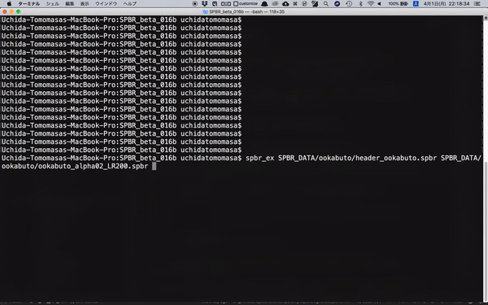

# SPBR_Brightness-Adjustment

## Prerequisites
- KVS: 2.9.0
- SPBR: beta-19a

## New Command
```
#/BrightnessAdjustment 1 or 0 (default: 0)
```

## Usage
```bash
$ spbr_ex input.spbr
```

or

```bash
$ spbr_ex input.ply
```

<!-- ## Demo movie
 -->